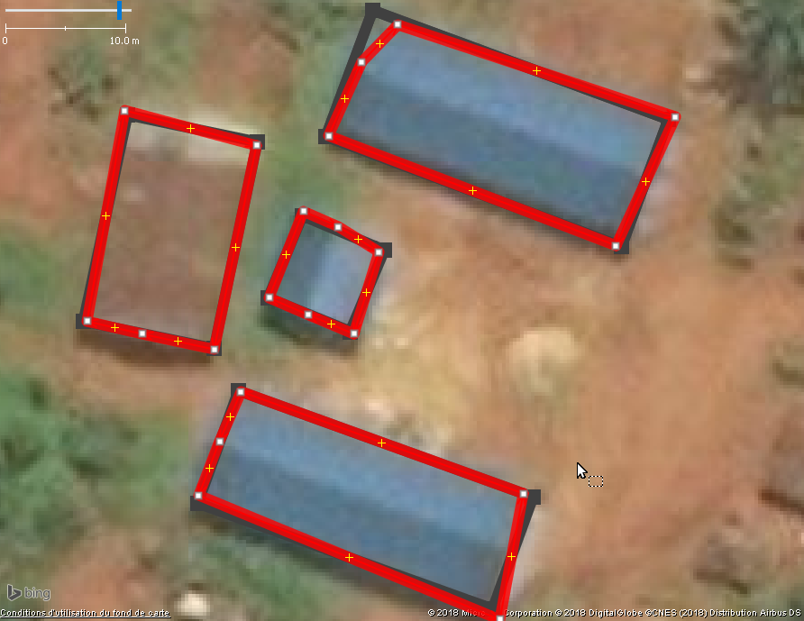
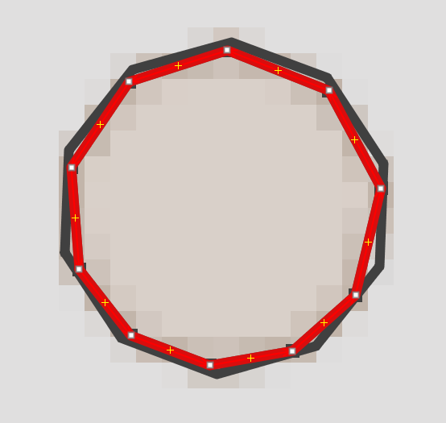

## 2018-08-08 Analyse de la géométrie des bâtiment pour une meilleure qualité OpenStreetMap

Le support technique à la communauté OpenStreetMap RDC par l'équipe Potentiel 3.0 prend différentes formes, 
comme le support à la formation, l'acquisition d'images de drones, l'acquisition de données et des outils de suivi et gestion des activités.

Sur les listes OSM, il y a des discussions constantes sur la qualité du bati ajouté à la base OSM avec la croissance constante des Mapathons 
en particulier pour répondre aux crises humanitaires. Il est donc important de voir si d'autres avenues peuvent mieux soutenir le travail
des validateurs OSM, permettre de repérer rapidement les objets/zones à examiner de plus près.  
Avec les deux réponses consécutives à l'épidémie d'Ebola en mai et août, les équipes Potentiel 3.0 et OSM0-RDC se sont mises d'accord 
pour identifier des mesures de la qualité des données produites et l production d'information pour corriger les erreurs.  

Selon cet indiqcateur, 96,5 % des bâtiments correspondent aux règles topologiques les plus usuelles (angles orthogonaux ou régulier). Cela est rassurant avec seulement 3,5% des bâtiments qui doivent être examinés de plus près. Cette analyse automatique n'est pas nécessairement parfaite, des bâtiments orthogonaux pouvant être aussi mal tracés. C'est cependant un angle de plus pour analyser et corriger le tracé des bâtiments. Et notre objectif en focalisant sur l'analyse de ces bâtiments irréguliers, est de valider les contributions les plus problématiques, les plus imprécises. 

**Figure 1**

Dans cet article du Blog, nous présenterons les résultats préliminaires de notre analyse. Nous pensons qu'ils sont suffisamment intéressants pour être partagés avec la communauté et discuter pendant que nous continuons à surveiller cette réponse humanitaire. 
Ces données ont été produites rapidement à partir des données de suivi dans le contexte de cette deuxième réponse Ebola au nord de la RDC qui . Nous devrions ensuite procéder à une analyse de proximité des objets (c'est-à-dire les chevauchements de bâtiments, les bâtiments qui traversent d'autres types de polygones, les autoroutes, les voies navigables, etc).

## Base de données PostGIS

Notre base de données PosgreSQL - PostGIS OSM_hist id une adaptation du[Osmosis Pgsnapshot schema](https://github.com/openstreetmap/osmosis/blob/master/package/script/pgsnapshot_schema_0.6.sql) pour avoir la possibilité de stocker divers profils historiques OSM pour une zone dans un PosgreSQL - PostGIS et de gérer simplement. Dans cette base de données, chaque schéma représente un extrait. Par exemple, nous pouvons extraire les données de l'OSM pour une zone à différentes dates et voir la progression des données et la qualité des données pour cette zone.

## Analyse topologique

Lors de la comparaison des points d'un polygone, tous les points d'une ligne droite sont ignorés. Ensuite, 
pour réduire le bruit en comparant les angles du polygone, nous acceptons une variance jusqu'à deux 2% en comparant ces angles. Ceci peut être révisé rapidement et permettrait d'identifier plus de polygones à classer comme irréguliers. Il semble que la plus grande partie correspond à des huttes probablement tracées à la main.

Notre classification des bâtiments à partir de l'analyse topologique  :
 Polygones ouverts (erreur topologique lorsque le polygone n'est pas fermé)
- 2m2 (bâtiments de moins de 2 mètres carrés)
- s petit - moins les 5 points (trianges) 
- 5 à n'importe quel nb. de points
  - o Orthogonal (angles de 90 degrés)
  - r Angles réguliers (exemples de huttes)
  - nr Angles irréguliers

## Tâche 4947 

La tâche 4947 était complétée et validée le 6 août lorsque nous avons fait une extraction OSM pour la zone. Les outils topologique, en développement avant cette réponse, nous on permis d'analyser rapidement les résultats. 
Le tableau 1 montre que 95% des bâtiments sont orthogonaux et 1,4% sont réguliers pour un total de 96,5% des bâtiments jugés de forme régulièreé
 Pour les 3,5 % de bâtiments restants, nous ne pouvons pas conclure que ces bâtiments sont mal tracés puisque exceptionnellement on observe des batiments irréguliers.
 Il nous reste 650 bâtiments à examiner de plus près et corriger si nécessaire.

Les résultats de l'analyse topologique permettent de produire une liste d'identifiants OSM à partir desquels nous pouvons extraire 
les données l'OSM les plus récentes à partir de l'API Overpass, puis les analyser dans JOSM.

La figure 2 montre une carte d'ensemble des bâtiments avec ceux à valider mis en évidence. Le greffon Todo dans JOSM permet ensuite de parcourir chaque bâtiment pour analyser / corriger.

**Figure 2**

La figure 3 montre en rouge ce qui semble être des bâtiments orthogonaux qui ont été tracés grossièrement et qui peuvent être corrigés rapidement dans l'éditeur JOSM (figures en noir), en supprimant les points inutiles et en utilisant le raccourci Q pour obtenir une forme rectangulaire (orthogonale).

**Figure 3**

La figure 4 montre une hutte aux angles réguliers qui a été tracée à la main (en rouge). En cliquant sur ce chemin dans JOSM, nous utilisons le raccourci O pour obtenir une forme régulière (en noir). L'analyse rapide effectuée à date semble indiquer que la majorité des bâtiments irréguliers identifiés pourraient correspondre à des huttes.

*Figure 4*

Il y avait deux bâtiments avant l'intervention et 18 310 bâtiments ont été ajoutés.

**Tableau 1, Répartition des bâtiments selon le type de géométrie, zone de la tâche 4947, 2018-07-06*

| Type de Geometrie  |  Immeubles | 
| :------------- | ------------: |
| Polygone ouvert   | 0
| s Petit | 0 |
| 2m2 ou moins | 18 |
| nr Non Regulier | 632 |
| o Orthogonal | 17,408 |
| r Régulier | 254 |
| Total | 18312 |

**Tableau 2, Distribution des immeubles selon le type de géometrie et le nombres de points, zone Tâche 4947, 2018-07-06**

| Nb Points| 2m2 ou moins | nr Non Régulier | o Orthogonal | r Regulier | Total |
| ----: | ----------: | ----------: | -------------: | ----------: | -------------: |
| 5 | 18 | 371 | 16,652 | 0 | 17,041 |
| 6 | 0 | 47 | 39 | 0 | 86 |
| 7 | 0 | 43 | 548 | 15 | 606 |
| 8 | 0 | 5 | 7 | 2 | 14 |
| 9 | 0 | 11 | 128 | 58 | 197 |
| 10 | 0 | 3 | 1 | 2 | 6 |
| 11 | 0 | 143 | 13 | 109 | 265 |
| 13 | 0 | 2 | 13 | 3 | 18 |
| 15 | 0 | 1 | 3 | 1 | 5 |
| 17 | 0 | 1 | 2 | 0 | 3 |
| 19 | 0 | 1 | 0 | 0 | 1 |
| 20 | 0 | 2 | 0 | 64 | 66 |
| 21 | 0 | 2 | 0 | 0 | 2 |
| 25 | 0 | 0 | 1 | 0 | 1 |
| 29 | 0 | 0 | 1 | 0 | 1 |
| TOTAL | 18 | 632 | 17,408 | 254 | 18,312 |

