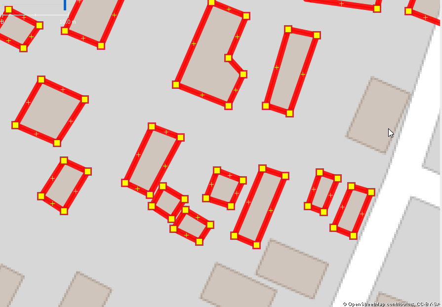
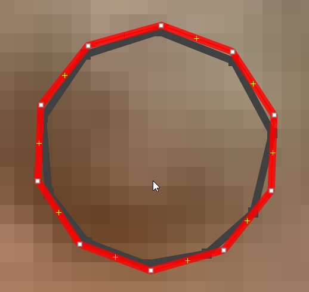

## Building Geometry Analysis to Support OpenStreetMap Quality Analysis

Technical support to the OpenStreetMap DRC Community by The Potentiel 3.0 Team takes various forms, like supporting with training, drone imagery acquisition, data acquisition and tools to better monitor / manage activities. 

Inaqccuracy, topological errors while tracing Building brings constant discussion on the OSM groups with the extension of Mapathon in particular to respond to humanitarian crisis and new approachs anre necessary to support adequately the OSM validators work and spot rapidly objects / areas to look at more closely.  With the two consecutive Ebola responses in may and august, the Potentiel 3.0 and OSM0-DRC teams have aggreed to look more closely at the quality of the data produced, to produce quality measure of the data produced and produce information to correct it.  Our indicator of the % of buildings that correspond to Topological rules (either an orthogonal or regular type) is relatively re-assuring with about 96.5% of the buildings responding to these criterias. Validation data that we can produce shoule help to validate and correct if necessary other buildings.

Figure 1

In this Blog article, we will present the first steps of our project with the building geometry topological analysis produced rapidly from data that we monitor in the context of this second Ebola response north of DRC that started august 1. This data was added in the area that correspond to the [task 4857](https://tasks.hotosm.org/project/4857). We should follow later with objects proximity analysis (ie building overlaps, building crossing other polygon types, highways, waterways, etc.). 

## PostGIS database

Our PosgreSQL - PostGIS OSM_hist database id an adaptation the [Osmosis Database schema](https://wiki.openstreetmap.org/wiki/Osmosis) to have the ability to store various OSM historic profiles for an area in a PosgreSQL - PostGIS and manage simply. In this database, each schema represent one extract. For example, we can extract the OSM data for an area at variouus dates and see the progress of the data and data quality for this area.

## Topological analysis

All the points on a straight line are ignored from the analysis (no angle).

Our classification of buildings from the Topological analysis was :
- Open polygons (topological error when the polygon is not closed)
- 2m2 (buildings with less then 2 square meters)
- s small - less the 5 points (trianges) 
- 5 to any nb. of points
 -- o Orthogonal (90 degre angles)
 -- r Regular angles (example huts)
 -- nr Irregular angles
 
## Task 4857 

The second Ebola response started august 1 and the task 4857 completed by august 6. The tools that we started to develop before  this response, let us analyze rapidly the results. From table 1, we see that 95% of the buildings are orthogonaal and 1.4% are regular for a total of 96.5% of buildings that can be considered to respect topological rules. For the other 3.5% of buildings, we cannot conclude that these buildings are wrongly traced. But we have now only 650 buildings to look at more closely and see patterns, necessary corrections to apply.

The results of the topological analysis let's produce a list of OSM id's from which we can extract from Overpass the OSM current data and analyze in JOSM.

The figure 1 shows an overview map with highlighted buildings in areas where to look at more closely. The Todo plugin in JOSM let's go through each building to analyze / correct.

**Figure 1**

Figure 2 shows in red what's appear to be orthonal buildings that were traced roughly and can be corrected rapidly into josm (figures in black), removing unneccessary points and using Q shortcut to make a rectangular (orthogonal) form.

Figure 2

Figure 3 shows a hut with regular angles that was traced by hand (in red). Clicking on this way, we use the O shortcut to obtain a regular form (in black).

Figure 3

There were 2 buildings before the response and 18,310 buildings added.

**Table 1 Building Distribution by Geometry type, Task 4857 area, 2018-07-06**

| Geometry type  |  Buildings | 
| :------------- | ------------: |
| Open Polygon   | 0
| s Small | 0 |
| 2m2 or less | 18 |
| nr Non Regular | 632 |
| o Orthogonal | 17,408 |
| r Regular | 254 |
| Total | 18312 |
(see Table 2 at the end of this article for details about the buildings data)

**Table 2 Building Distribution by Geometry type and number of points, Task 4857 area, 2018-07-06**

| Nb Points| 2m2 or less | nr Non Regular | o Orthogonal | r Regular | Total |
| ----: | ----------: | ----------: | -------------: | ----------: | -------------: |
| 5 | 18 | 371 | 16,652 | 0 | 17,041 |
| 6 | 0 | 47 | 39 | 0 | 86 |
| 7 | 0 | 43 | 548 | 15 | 606 |
| 8 | 0 | 5 | 7 | 2 | 14 |
| 9 | 0 | 11 | 128 | 58 | 197 |
| 10 | 0 | 3 | 1 | 2 | 6 |
| 11 | 0 | 143 | 13 | 109 | 265 |
| 13 | 0 | 2 | 13 | 3 | 18 |
| 15 | 0 | 1 | 3 | 1 | 5 |
| 17 | 0 | 1 | 2 | 0 | 3 |
| 19 | 0 | 1 | 0 | 0 | 1 |
| 20 | 0 | 2 | 0 | 64 | 66 |
| 21 | 0 | 2 | 0 | 0 | 2 |
| 25 | 0 | 0 | 1 | 0 | 1 |
| 29 | 0 | 0 | 1 | 0 | 1 |
| All Buildings | 18 | 632 | 17,408 | 254 | 18,312 |

